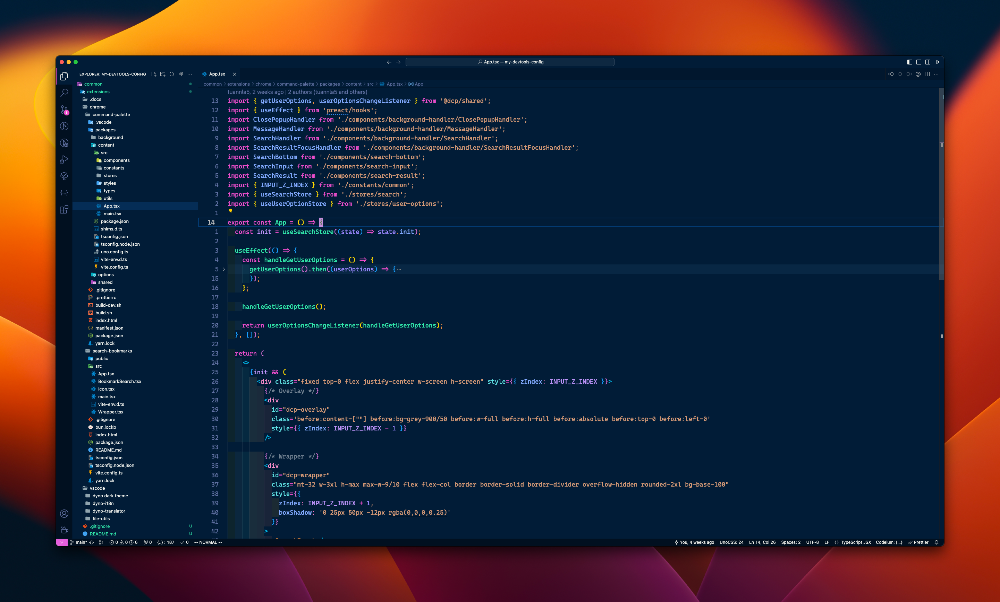
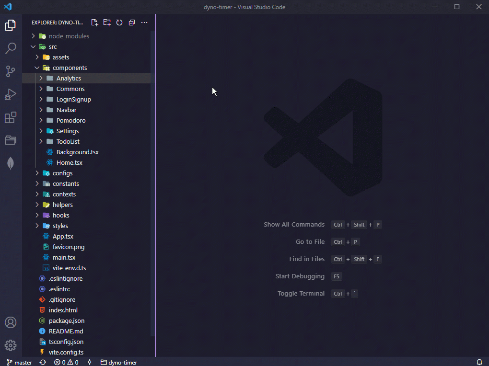
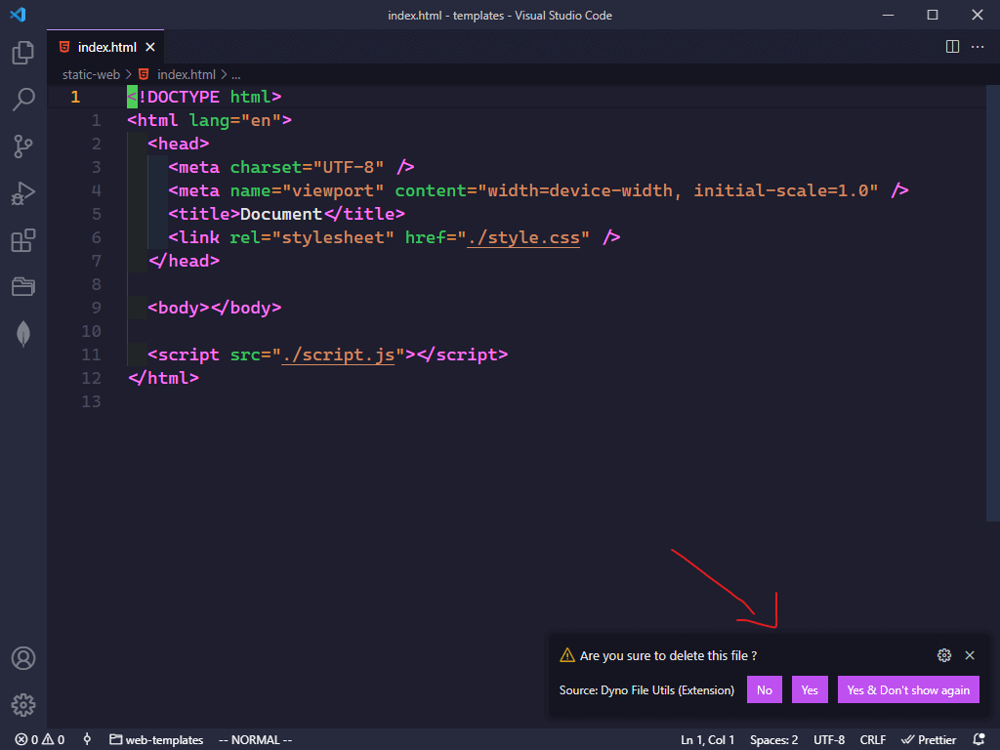
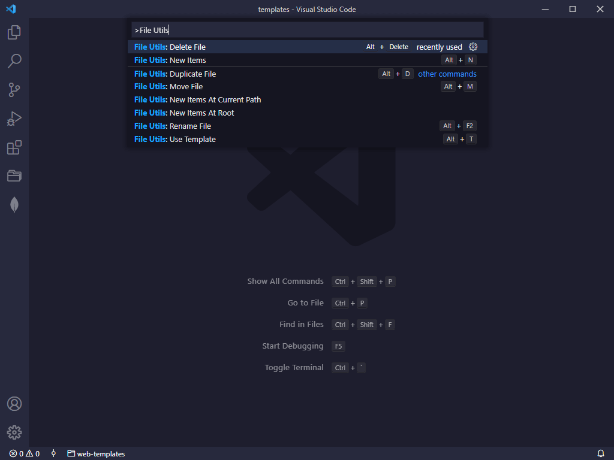
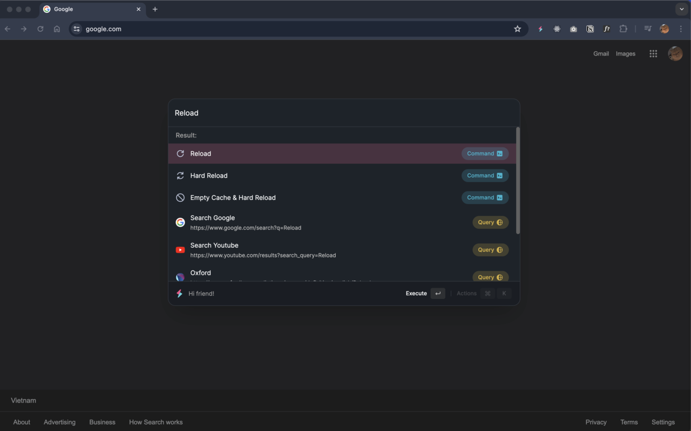
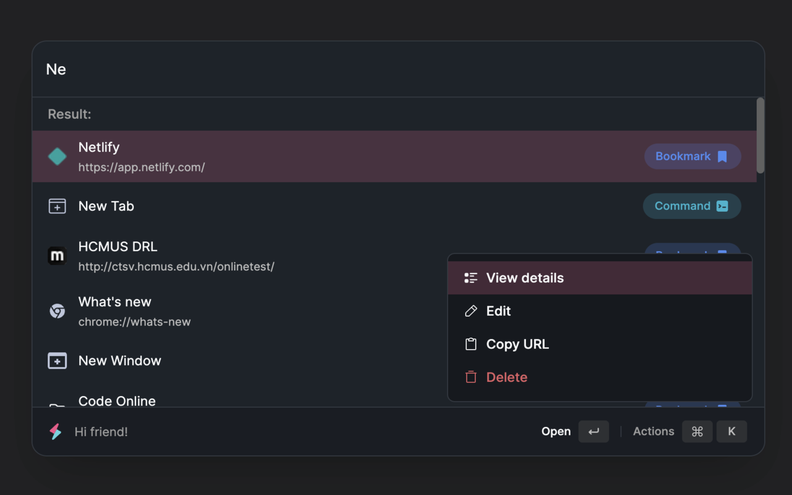
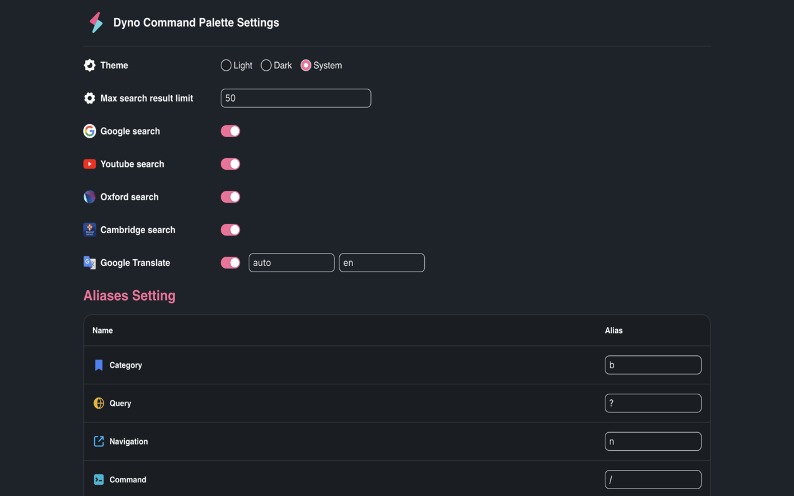
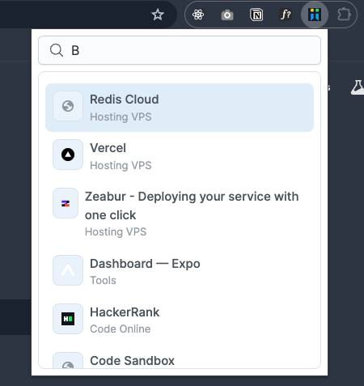

# My Chrome & VSCode Extensions 🧑‍💻

## VSCode Extensions

### Dyno Dark Theme

> Dyno Dracula Dark Mode Theme. Inspired by [Dracula Official](https://marketplace.visualstudio.com/items?itemName=dracula-theme.theme-dracula)

[Install - Marketplace](https://marketplace.visualstudio.com/items?itemName=dyno-nguyen.dyno-dark-mode)

### File Utils

> The best way to create, copy, move, rename and delete files and folders (multiple files) & create templates. Inspired by: [File Utils](https://marketplace.visualstudio.com/items?itemName=sleistner.vscode-fileutils)

[Install - Marketplace](https://marketplace.visualstudio.com/items?itemName=dyno-nguyen.vscode-dynofileutils)

## Chrome Extensions

### Dyno Command Palette

> Explore Chrome effortlessly with a powerful command palette 🚀

### Search Bookmarks

> Search bookmarks extremely quickly ⚡

