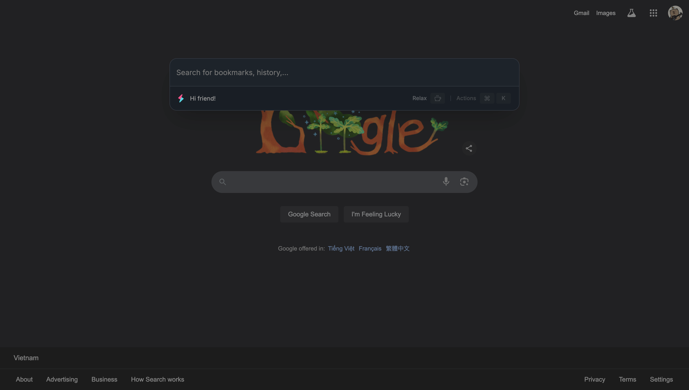
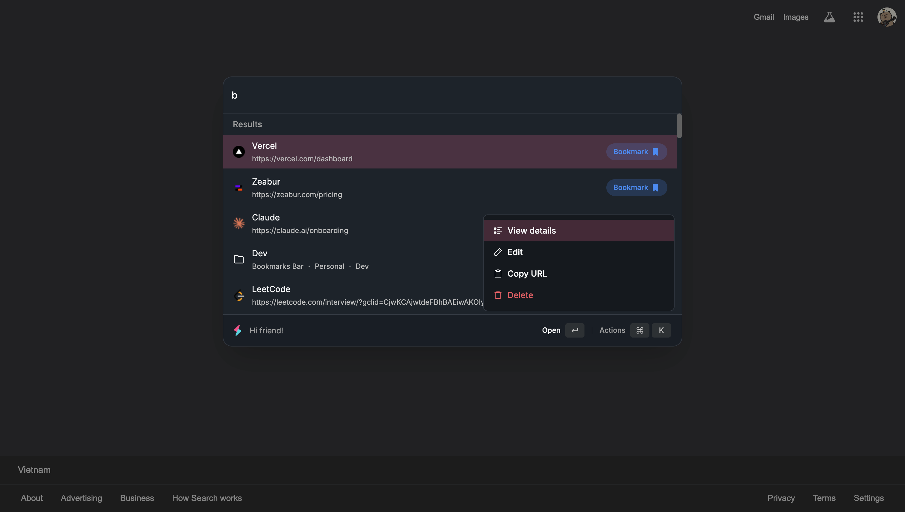
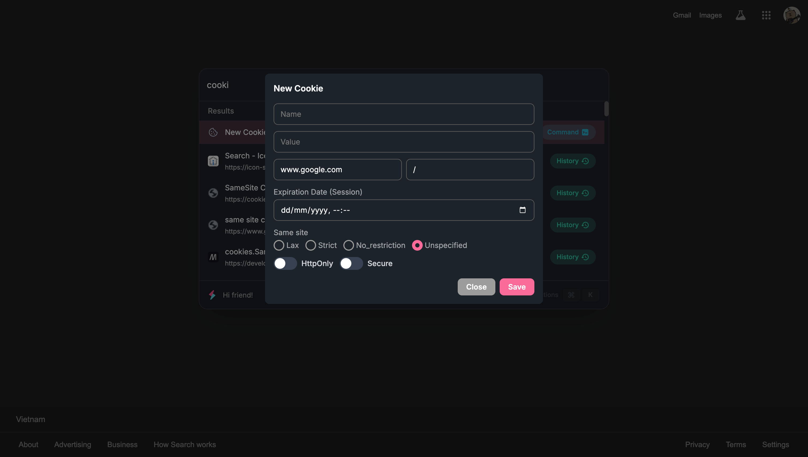
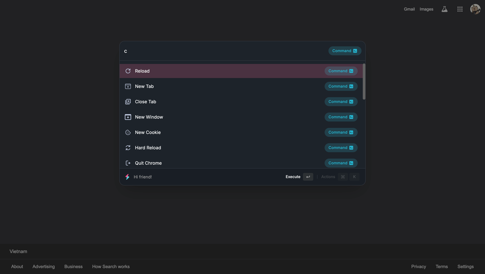
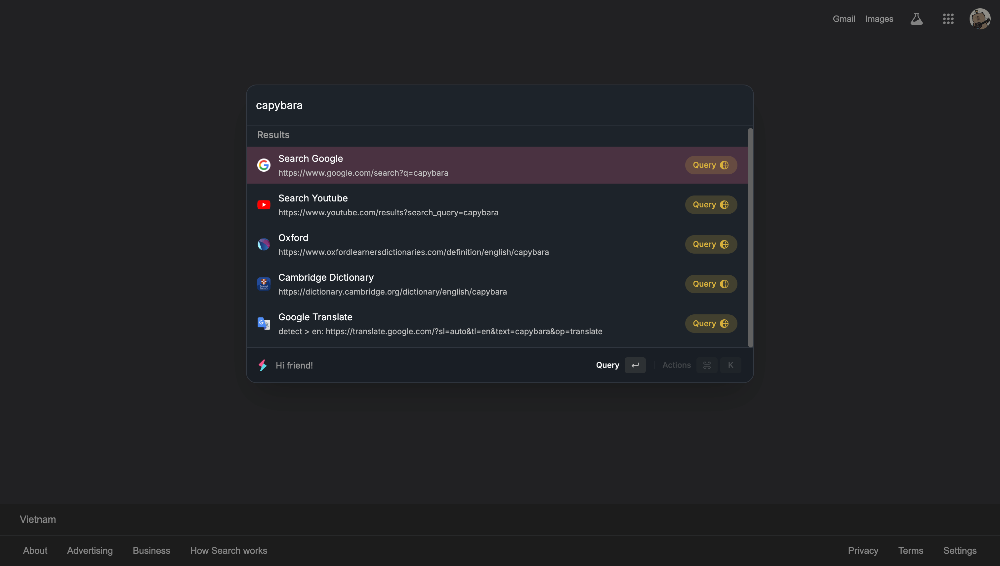

# My Chrome & VSCode Extensions 🧑‍💻

## VSCode Extensions

### File Utils

The best way to create, copy, move, rename and delete files and folders (multiple files) & create templates. Inspired by: [File Utils](https://marketplace.visualstudio.com/items?itemName=sleistner.vscode-fileutils)

[Source Code](./vscode/file-utils/README.md)

[Install VSCode Extension](https://marketplace.visualstudio.com/items?itemName=dyno-nguyen.vscode-dynofileutils)

  
Demo

### Dyno Dark Theme

Dyno Dracula Dark Mode Theme. Inspired by [Dracula Official](https://marketplace.visualstudio.com/items?itemName=dracula-theme.theme-dracula)

[Source Code](./vscode/dyno%20dark%20theme/README.md)

[Install VSCode Extension](https://marketplace.visualstudio.com/items?itemName=dyno-nguyen.dyno-dark-mode)

  
Demo

## Chrome Extensions

### Dyno Command Palette

Explore Chrome effortlessly with a powerful command palette 🚀

This extension empowers you to take complete control over your Chrome browsing experience by offering comprehensive management tools for bookmarks, extensions, history, tabs, and commands. Inspired by VSCode command palette and Raycast.

[Source Code](./chrome/command-palette/README.md)

[Install Chrome Extension](https://chromewebstore.google.com/detail/dyno-command-palette/pecgnckollojbdbpklfjiojddlpmdgim?hl=en)

  
Demo

